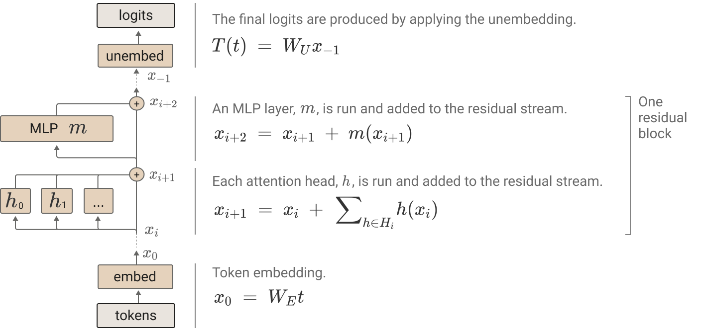
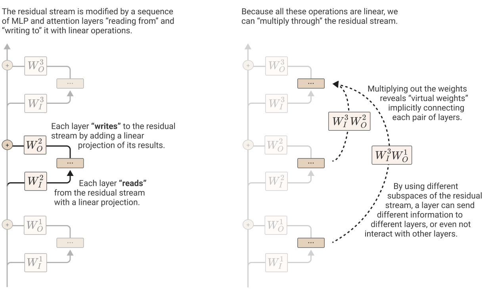
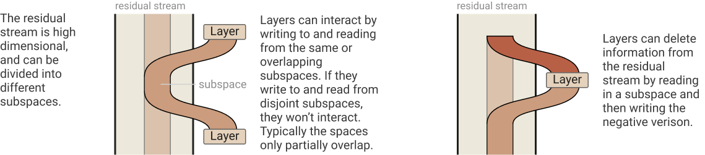
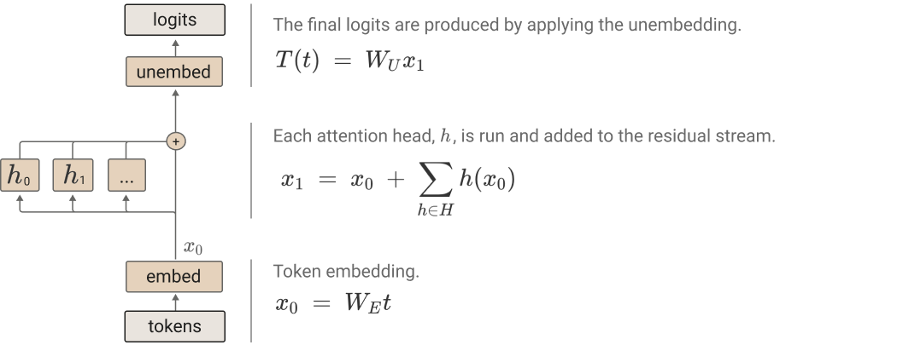
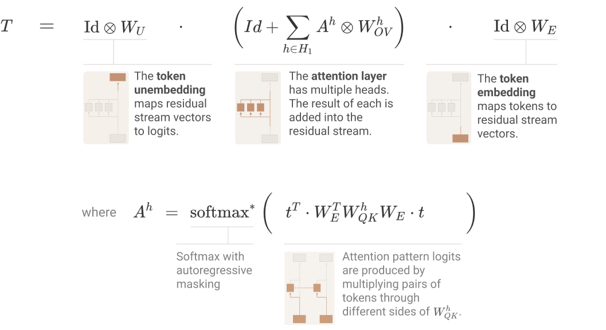
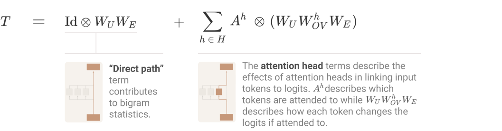

# Mechanistic Interpretability

## Source:
1. [Transformer Circuit](https://transformer-circuits.pub/2021/framework/index.html)
2. [Distill Circuit](https://distill.pub/2020/circuits/)

## What is a transformer ?
It is a sequence prediction machine. 

### Components of transformer:
- Embedding
- Position Embedding
- Residual block ($\times n_{layers}$)
    - Attention heads
    - MLP layer
- Unembedding

### Residual block:

Both attention heads and MLP layers read off their input from the residual stream and perform a linear projection
then they write their results to the residual stream by adding a linear projection back in.
Each residual block contains multiple attention heads, which operate in parallel.

1. Attention heads:
    Independent operations each outputting a result which can be added to residual stream.

    Contains 2 circuits:
    - QK (query-key) circuit - computes attention pattern.
    - OV (output-value) circuit - computes how each token affects the output if attented to.

    All components of transformers (token embedding, attention heads, MLP layers, unembedding) communicate with each other
    by reading and writing to different subspaces of the residual stream.
    It is helpful to decompose the residual stream into all these different communication channels.
2. MLP Layers:

## Residual stream concepts:

Residual stream is linear in structure. It is simply the sum of output of all previous layers and original embedding.
It is considered as a communication channel between different layers.

### Virtual weights:
The linear and additive structure of residual stream allows interaction of output and input between different layers, even if they are
far apart.

### Subspaces and residual stream bandwidth:

Residual stream is a high dimensional vector space. Layers can send different information to different layers by
storing it in different subspaces.
Individual attention heads have dimensionality of (64 or 128) and can very easily write to completely disjoint subspaces.

This allows residual stream to work like a memory or bandwidth that allows information to be stored in disjoint subspaces to persist.

Steps:
1. Compute value vector for each token in residual stream $v_i = W_V x_i$
2. Compute result vectors by linearly combining value vectors based on attention pattern. $r_i = \sum_j A_{i,j}v_j$
3. Cmopute output vectors of the head for each token. $h(x)_i = W_O r_i$

The above steps can be represented in the [Tensor notation](https://transformer-circuits.pub/2021/framework/index.html#notation-tensor-product) as following:

$$
h(x) = \underbrace{(I \otimes W_O)}_{\text{Output vector for each token}} \cdot \underbrace{(A \otimes I)}_{\text{Linear comb. of value vectors across tokens}} \cdot \underbrace{(I \otimes W_V)}_{\text{Value vector for each token}} \cdot x
$$
$$h(x) = (A \otimes W_O \cdot W_V) \cdot x$$
 

Tensor notation:
$$\boxed{h(x) = (A \otimes W_{OV}) \cdot x}$$

 

Matrix notation:
$$
\boxed{\underbrace{h(x)}_{\text{p x r}} = \underbrace{A \cdot x \cdot W_V^{T} \cdot W_O^{T}}_{\text{(p x p) (p x r) (r x h) (h x r)}}}

\\ p \to position \space dimension
\\ r \to residual \space stream \space dimension
\\ h \to attention \space head \space dimension
$$
 

> $W_v^{T} \cdot W_o^{T}$ matrix is OV (output-value) circuit
>
> TODO: Read more about low rank factorization of matrices.

 

$$\underbrace{W_{QK}}_{\text{r x r}} = \underbrace{W_Q^TW_K}_{\text{(r x h) (h x r)}}$$

$$
\boxed{\underbrace{A}_{\text{p x p}} = softmax(\underbrace{x^T \cdot W_{QK} \cdot x}_{\text{(p x r) (r x r) (r x p)}})}
$$

> $x$ is the residual stream matrix
>
> $A$ is the attention matrix
>
> $W_Q^T \cdot W_K$ matrix is the QK (query-key) circuit

 
 

## Zero layer transformer:

Such a model takes a token, embeds it, unembeds it to produce logits predicting next token.

$T = W_U W_E$

This means that the optimal behavior of this transformer is to approximate the bigram log-likelihood. Such a model is also called a `bigram model`.

This is relevant to transformers more generally. 

Terms of the form $T = W_U W_E$ will occur in the expanded form of equations for every transformer, corresponding to the “direct path” where a token embedding flows directly down the residual stream to the unembedding, without going through any layers. The only thing it can affect is the bigram log-likelihoods. 

In particular, this term seems to often help represent bigram statistics which aren’t described by more general grammatical rules, such as the fact that “Barack” is often followed by “Obama”.

> Note $W_U$ and $W_E$ are not inverse or identical of each other. Which means, if "Obama" follows "Barack", then the inverse is not necessarily true.

## Single layer transformer:

$$
T = \underbrace{(I \otimes W_U)}_{\text{unembedding}} \cdot \underbrace{(I + \sum_{\substack{h \in H}} A^h \otimes W_{OV}^h)}_{\text{attention layer contribution}} \cdot \underbrace{(I \otimes W_E)}_{\text{embedding}}
$$

where,
$$
A^h = softmax(t^T \cdot W_E^T W_{QK}^h W_E \cdot t)
$$

$$
\boxed{T = \underbrace{(I \otimes W_UW_E)}_{\text{Direct path, zero layer transformer}} + \underbrace{\sum_{\substack{h \in H}} A^h \otimes W_U W_{OV}^h W_E}_{\text{Attention head terms}}}
$$

The claim is that each of these end-to-end path terms is tractable to understand, can be reasoned about independently, and additively combine to create model behavior.

The direct path term, also occurred when we looked at the zero-layer transformer. Because it doesn’t move information between positions, the only thing it can contribute to is the bigram statistics, and it will fill in missing gaps that other terms don’t handle there.